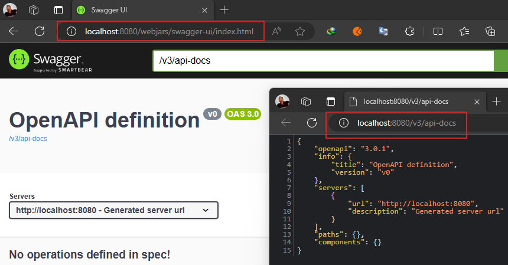

# [Creación de una aplicación web colaborativa mediante programación reactiva](https://medium.com/pictet-technologies-blog/build-a-collaborative-web-application-using-reactive-programming-b6d6b8c9aef4)

- Tutorial tomado de la página `Medium` del autor `Alexandre Jacquot`.
- Repositorio del tutorial [reactive-todo-list](https://github.com/pictet-technologies-open-source/reactive-todo-list)

En este tutorial veremos cómo crear una aplicación web colaborativa utilizando `programación reactiva`. Lo construiremos
con `Angular`, `Spring Boot`, `Spring WebFlux` y `MongoDB`. Por último, para hacer frente a las modificaciones
concurrentes, utilizaremos el `bloqueo optimista`, los `flujos de cambios` y los `eventos enviados por el servidor`.

En el desarrollo web, las aplicaciones se componen de varias partes que interactúan entre sí. Algunas de estas
interacciones son bloqueantes por naturaleza, como las que involucran bases de datos.

- `En un sistema de bloqueo`, cuando un consumidor llama a una API para obtener datos, la llamada bloquea el subproceso
  hasta que todos los elementos seleccionados se recuperan de la base de datos y se devuelven al consumidor. Mientras se
  realiza la consulta, el subproceso se bloquea y esto es literalmente un desperdicio de recursos. Finalmente, cuando
  los datos se devuelven al consumidor, el subproceso se vuelve a colocar en el grupo y se pone a disposición para
  controlar otra solicitud.


- `En un sistema sin bloqueo`, la lectura de datos de la base de datos no bloquea el subproceso. Cada vez que se obtiene
  un registro, se publica un evento. Cualquier subproceso puede controlar el evento y enviar el registro al consumidor
  sin tener que esperar a que se recuperen los demás registros.

En la `documentación de Spring`, la programación reactiva se define de esta manera:

> En términos sencillos, la `programación reactiva` se refiere a aplicaciones `no bloqueantes` que son `asincrónicas` y
> `controladas por eventos` y requieren un pequeño número de subprocesos para escalar.

### La aplicación web colaborativa

La aplicación que vamos a crear es una aplicación web colaborativa en la que los usuarios pueden trabajar juntos en una
lista de tareas compartidas `(To Do List)`.

Los usuarios podrán:

- Agregar un item a la lista compartida.
- Editar la descripción de un item.
- Cambiar el status de un item.
- Eliminar un item.

---

## Crea contenedor de MongoDB con Docker Compose

Para crear una aplicación reactiva, necesitamos utilizar una base de datos en la que los datos sean accesibles sin
bloqueo, pero para nuestro caso de uso, esto no será suficiente. Como nuestro objetivo es hacer una aplicación
colaborativa, **debemos seleccionar una base de datos que nos permita escuchar todos los cambios de datos en
tiempo real.**

Para este tutorial usaremos `MongoDB`, pero otras bases de datos podrían haberse ajustado a nuestras necesidades,
incluidas las bases de datos relacionales como `PostgresSQL` o `MS SQL/Server`.

Para configurar una instancia en ejecución de `MongoDB` usaremos `Docker Compose`. Lo primero que debemos hacer es
crear el archivo `compose.yml` y agregar el siguiente servicio.

````yml
services:
  mongodb:
    image: mongo:6-jammy
    container_name: c-mongodb
    restart: unless-stopped
    environment:
      MONGO_INITDB_ROOT_USERNAME: magadiflo
      MONGO_INITDB_ROOT_PASSWORD: magadiflo
    ports:
      - '27017:27017'
    volumes:
      - mongo_data:/data/db
    networks:
      - reactive-todo-list-net

volumes:
  mongo_data:
    name: mongo_data

networks:
  reactive-todo-list-net:
    name: reactive-todo-list-net
````

En este tutorial, el autor hace uso de otro servicio para crear el contenedor de `Mongo-Express`, que es un cliente
web para `MongoDB`. En mi caso, no haré uso de `Mongo-Express`, ya que tengo instalado en mi pc local la aplicación
de `Studio 3T`, que es una aplicación que nos permite interactuar con `MongoDB`.

**NOTA**
> Para ver cómo configurar la instancia de `MongoDB` (contenedor de `Docker`) en `Studio 3T` ir al siguiente repositorio
> [microservices-e-commerce](https://github.com/magadiflo/microservices-e-commerce/tree/main/business-domain/customer-service#configura-studio-3t)

Para iniciar el entorno, ejecutemos el siguiente comando en la misma carpeta que el archivo `compose.yml`.

````bash
$ docker compose up -d                    
[+] Running 3/3                           
 ✔ Network reactive-todo-list-net  Created
 ✔ Volume "mongo_data"             Created
 ✔ Container c-mongodb             Started
 
 
$ docker container ls -a
CONTAINER ID   IMAGE            COMMAND                  CREATED         STATUS                        PORTS                      NAMES
7138c0fc7509   mongo:6-jammy    "docker-entrypoint.s…"   5 minutes ago   Up 5 minutes                  0.0.0.0:27017->27017/tcp   c-mongodb
````

Ahora, tenemos:

- Una sola instancia en ejecución de `MongoDB`.
- Un cliente como `Studio 3T` para interactuar con `MongoDB`.


## Dependencias

A continuación se muestran las dependencias que serán usadas en este proyecto.

````xml
<!--Spring Boot 3.3.3-->
<!--java.version 21-->
<!--org.mapstruct.version 1.6.0-->
<!--lombok-mapstruct-binding.version 0.2.0-->
<dependencies>
    <dependency>
        <groupId>org.springframework.boot</groupId>
        <artifactId>spring-boot-starter-data-mongodb-reactive</artifactId>
    </dependency>
    <dependency>
        <groupId>org.springframework.boot</groupId>
        <artifactId>spring-boot-starter-validation</artifactId>
    </dependency>
    <dependency>
        <groupId>org.springframework.boot</groupId>
        <artifactId>spring-boot-starter-webflux</artifactId>
    </dependency>
    <!--Agregado manualmente-->
    <dependency>
        <groupId>org.mapstruct</groupId>
        <artifactId>mapstruct</artifactId>
        <version>${org.mapstruct.version}</version>
    </dependency>
    <dependency>
        <groupId>org.springdoc</groupId>
        <artifactId>springdoc-openapi-starter-webflux-ui</artifactId>
        <version>2.6.0</version>
    </dependency>
    <!--/Agregado manualmente-->

    <dependency>
        <groupId>org.projectlombok</groupId>
        <artifactId>lombok</artifactId>
        <optional>true</optional>
    </dependency>
    <dependency>
        <groupId>org.springframework.boot</groupId>
        <artifactId>spring-boot-starter-test</artifactId>
        <scope>test</scope>
    </dependency>
    <dependency>
        <groupId>io.projectreactor</groupId>
        <artifactId>reactor-test</artifactId>
        <scope>test</scope>
    </dependency>
</dependencies>
````

### ¿Cómo se configuró MapStruct?

**Fuente**

- [MapStruct.org](https://mapstruct.org/documentation/installation/)
- [Medium](https://medium.com/@tijl.b/a-guide-to-mapstruct-with-spring-boot-vavr-lombok-d5325b436220)
- [Refactorizando](https://refactorizando.com/en/guide-to-mapstruct-with-spring-boot/)
- [Baeldung](https://www.baeldung.com/mapstruct)
- [sb-hexagonal-architecture](https://github.com/magadiflo/sb-hexagonal-architecture/blob/main/README.md)

En las dependencias anteriores podemos observar que estamos haciendo uso de `mapstruct`. `MapStruct` es una dependencia
que nos va a permitir realizar algún tipo de conversión entre objetos java. Por ejemplo, si tenemos un DTO y queremos
transformarlo a una entidad.

A continuación, documentaré la configuración que se hizo de la dependencia de `MapStruct`. Lo primero que hicimos fue
definir las siguientes propiedades en el `pom.xml`. La versión de `java` es con la que construimos el proyecto de
Spring Boot, mientras que las otras dos propiedades corresponden a la versión actual desde el momento en que se
construyó este proyecto de la dependencia de `mapstruct` y el plugin `lombok-mapstruct-binding`, este último plugin
es importante, dado que al trabajar con `lombok`, necesitamos que tanto `mapStruct` y `lombok` puedan trabajar en
conjunto sin problemas.

````xml

<properties>
    <java.version>21</java.version>
    <org.mapstruct.version>1.6.0</org.mapstruct.version>
    <lombok-mapstruct-binding.version>0.2.0</lombok-mapstruct-binding.version>
</properties>
````

A continuación, agregamos la dependencia de `MapStruct` al `pom.xml`.

````xml

<dependency>
    <groupId>org.mapstruct</groupId>
    <artifactId>mapstruct</artifactId>
    <version>${org.mapstruct.version}</version>
</dependency>
````

Ahora en el apartado de `plugins` necesitamos extender el `maven-compiler-plugin` para activar la generación de
código de `MapStruct`. Le agregamos el plugin de `MapStruct` y le incluimos `lombok`. `MapStruct` es nuestro
primer procesador de anotaciones, seguido directamente por `Lombok`. Se necesita otra referencia a
`lombok-mapstruct-binding` para que estas dos bibliotecas funcionen juntas. Sin `Lombok` en el proyecto, en este
momento solo se necesitaría el procesador `mapstruct`.

````xml

<plugin>
    <groupId>org.apache.maven.plugins</groupId>
    <artifactId>maven-compiler-plugin</artifactId>
    <version>${maven-compiler-plugin.version}</version>
    <configuration>
        <source>${java.version}</source>
        <target>${java.version}</target>
        <annotationProcessorPaths>
            <path>
                <groupId>org.mapstruct</groupId>
                <artifactId>mapstruct-processor</artifactId>
                <version>${org.mapstruct.version}</version>
            </path>
            <path>
                <groupId>org.projectlombok</groupId>
                <artifactId>lombok</artifactId>
                <version>${lombok.version}</version>
            </path>
            <path>
                <groupId>org.projectlombok</groupId>
                <artifactId>lombok-mapstruct-binding</artifactId>
                <version>${lombok-mapstruct-binding.version}</version>
            </path>
        </annotationProcessorPaths>
    </configuration>
</plugin>
````

### ¿Cómo se configuró Swagger?

**Fuente**

- [springdoc.org](https://springdoc.org/#general-overview)
- [spring-boot-swagger](https://github.com/magadiflo/spring-boot-swagger/blob/main/README.md#trabajando-con-swagger)

Para la integración entre `Spring Boot Webflux` y `Swagger-ui`, agregue la biblioteca a la lista de dependencias de su
proyecto `(no se necesita configuración adicional)`.

````xml

<dependency>
    <groupId>org.springdoc</groupId>
    <artifactId>springdoc-openapi-starter-webflux-ui</artifactId>
    <version>2.6.0</version>
</dependency>
````

Esto implementará automáticamente `swagger-ui` en una aplicación `spring-boot`. Ahora, sin haber realizado ninguna
configuración, tan solo agregando la dependencia de `Swagger`, podemos ejecutar el proyecto y abrir en el navegador
la siguiente dirección.

````bash
$ http://localhost:8080/webjars/swagger-ui/index.html
````

La documentación también puede estar disponible en formato `json` o `yaml`, en la siguiente ruta:

````bash
# Formato JSON
$ http://localhost:8080/v3/api-docs

# Formato Yaml
$ http://localhost:8080/v3/api-docs.yaml 
````



## El modelo de datos

Vamos a crear nuestra entidad `Item` y luego explicaré algunas de las anotaciones que se está usando.

````java

@EqualsAndHashCode(onlyExplicitlyIncluded = true)
@ToString
@AllArgsConstructor
@NoArgsConstructor
@Builder
@Setter
@Getter
@Document(collection = "items")
public class Item {

    @Id
    @EqualsAndHashCode.Include
    private String id;
    private String description;
    private ItemStatus status = ItemStatus.TO_DO;

    @Version
    private Long version;

    @CreatedDate
    private Instant createdDate;

    @LastModifiedDate
    private Instant lastModifiedDate;
}
````

La entidad `Item` hace uso de un `enum` donde definimos los distintos estados del item.

````java
public enum ItemStatus {
    TO_DO,
    IN_PROGRESS,
    DONE
}
````

Ahora que ya hemos definido nuestra entidad `Item` y su enum `ItemStatus`, pasamos a describir algunas de sus
anotaciones.

### @EqualsAndHashCode(onlyExplicitlyIncluded = true)

Esta anotación es parte de `Lombok` y se utiliza para generar automáticamente los métodos `equals()` y `hashCode()` para
la clase.

Cuando el parámetro `onlyExplicitlyIncluded` se establece en `true`, indica que solo se deben incluir en la
comparación aquellos campos que han sido explícitamente marcados con `@EqualsAndHashCode.Include`.

Esto significa que solo los campos que tú decides incluir estarán considerados en la lógica de igualdad y en el
cálculo del hash. Los campos que no estén marcados serán ignorados.

### @EqualsAndHashCode.Include

Esta anotación se utiliza para marcar los campos que deseas incluir en los métodos `equals()` y `hashCode()`.

Al usar `@EqualsAndHashCode.Include` en un campo (como `id` en tu caso), estás indicando que este campo debe ser
considerado para determinar la igualdad de instancias de la clase.

Esto es útil en situaciones en las que solo ciertos campos son relevantes para la comparación de objetos, lo cual es
común en entidades de bases de datos donde el campo id es único.

**Con las anotaciones como las tenemos definidas:**

- Dos objetos `Item` se considerarán iguales `(equals())` si tienen el mismo valor de `id`, independientemente de los
  valores de los otros campos.
- El valor del código hash `(hashCode())` también se calculará solo usando el campo `id`.

**NOTA**
> En el tutorial se hace uso de la anotación `@EqualsAndHashCode(of = "id")`, es decir, se usa el atributo `of` para
> definir los campos a incluir en el cálculo del `equals` y `hashCode`, pero según la misma documentación de `Lombok`
> menciona que `pronto se marcará como @Deprecated; nos recomienda que usemos la anotación @EqualsAndHashCode.Include
> junto con @EqualsAndHashCode(onlyExplicitlyIncluded = true).`

### @Version

Esta anotación es utilizada en `MongoDB` para implementar control de versiones en una entidad. Su función
principal es manejar la concurrencia optimista. Cuando una entidad es modificada, el valor de este campo `version` se
incrementa automáticamente. Esto permite a `MongoDB` detectar si la entidad ha sido modificada desde la última
lectura, ayudando a evitar conflictos cuando múltiples operaciones intentan actualizar la misma entidad al mismo
tiempo. Si una actualización ocurre y el valor de la versión no coincide con el valor esperado, `MongoDB` lanzará una
excepción para indicar que la entidad ha cambiado.

### @CreatedDate

Esta anotación se usa para marcar un campo que debe ser automáticamente establecido con la fecha y hora en que se creó
el documento en la base de datos. Es útil para rastrear cuándo fue creado el documento. La fecha y hora se establecen al
momento de la inserción del documento y no se actualizan posteriormente.

### @LastModifiedDate

Esta anotación marca un campo para que sea automáticamente actualizado con la fecha y hora de la última modificación del
documento. Cada vez que el documento es actualizado, este campo se actualiza para reflejar la última vez que se
modificó. Es útil para tener un registro de la última vez que el documento fue modificado.

Notar que el tipo de dato usado en los campos `createdDate` y `lastModifiedDate` son del tipo `Instant`. Podría haber
usado el `LocalDateTime`, pero en el tutorial usan `Instant`. Además, existen diferencias entre un tipo `Instant` y un
`LocalDateTime`.

- `Instant`
    - `Formato`: Siempre retorna en el formato de año, mes, día, hora, minuto, segundo, etc.
      `2024-09-11T00:23:40.831022600Z` (en UTC).
    - `Zona Horaria`: Siempre está en `UTC` (Tiempo Universal Coordinado), lo que significa que el valor es el mismo sin
      importar la ubicación geográfica.
    - `Consistencia`: Ideal para situaciones donde necesitas un punto de tiempo que sea universal y consistente, como en
      sistemas distribuidos o registros de eventos.


- `LocalDateTime`
    - `Formato`: También retorna en el formato de año, mes, día, hora, minuto, segundo, etc.
      `2024-09-10T19:23:40.830022700` (en la zona horaria de tu PC, que es UTC-5)
    - `Zona Horaria`: La fecha y hora se ajustan según la zona horaria local de la máquina donde se ejecuta el código.
      Esto significa que el resultado puede variar dependiendo de la configuración regional de la computadora o el país
      en el que te encuentres.
    - `Uso`: Útil para aplicaciones que requieren trabajar con fechas y horas en un contexto local, como eventos
      programados, horarios de trabajo o cualquier cosa que dependa de la hora local.

**Por lo tanto:**

- `Instant` es independiente del país o zona horaria. Siempre muestra la fecha y hora en `UTC`.
- `LocalDateTime` es dependiente de la zona horaria local de tu sistema. Muestra la fecha y hora local correspondiente a
  la configuración actual de la zona horaria.

## Habilita anotaciones de auditoría

Para poder habilitar el soporte de auditoría a los campos anotados con `@CreatedDate` y `@LastModifiedDate` y estos
funcionen correctamente, y además, se gestionen de manera automática, debemos agregar la anotación
`@EnableReactiveMongoAuditing` en una clase de configuración. En nuestro caso lo anotaré en la clase principal de la
aplicación.

````java

@EnableReactiveMongoAuditing
@SpringBootApplication
public class TodoListBackendApplication {
    public static void main(String[] args) {
        SpringApplication.run(TodoListBackendApplication.class, args);
    }
}
````

Con respecto a la anotación `@Version`, esta anotación no requiere que se le habilite nada para que funcione, es decir,
`Spring Data Reactive MongoDB` lo maneja directamente sin requerir alguna configuración adicional.
`Spring Data Reactive MongoDB` se encargará de actualizar automáticamente el campo `version` en cada operación de
actualización para asegurar el control de versiones y la concurrencia optimista. La anotación `@Version` se encarga de
incrementar el valor del campo version en cada actualización del documento, lo que ayuda a manejar los conflictos de
concurrencia.

## El repositorio

El repositorio que crearemos extenderá de `ReactiveMongoRepository`.

````java
public interface ItemRepository extends ReactiveMongoRepository<Item, String> {
}
````

## Configura propiedades de configuración de la aplicación

A continuación se explicarán algunas configuraciones realizadas en el archivo `application.yml`:

- El `username` y `password` especificado es `magadiflo`, que coinciden con las credenciales proporcionadas en la
  configuración de `Docker Compose`.

- Hemos configurado un `authentication-database: admin`. Esta configuración es relevante cuando necesitas especificar
  la base de datos que contiene las credenciales de usuario que se utilizarán para autenticarte. Por defecto, `MongoDB`
  utiliza la base de datos `admin` para autenticar a los usuarios si no se especifica otra base de datos.

- `admin` es la base de datos por defecto utilizada para la autenticación en `MongoDB` cuando se configuran usuarios de
  administración. Esto es correcto según la configuración de `Docker Compose` que proporcionaste.
  (Para mayor información sobre esta propiedad visitar mi otro repositorio
  [microservices-e-commerce](https://github.com/magadiflo/microservices-e-commerce/blob/main/business-domain/customer-service/README.md#agrega-propiedades-de-configuraci%C3%B3n))

````yml
server:
  port: 8080
  error:
    include-message: always

spring:
  application:
    name: todo-list-backend
  data:
    mongodb:
      host: localhost
      port: 27017
      database: db_reactive_todo_list
      username: magadiflo
      password: magadiflo
      authentication-database: admin

logging:
  level:
    org.springframework.data.mongodb.core.ReactiveMongoTemplate: DEBUG
````

La configuración `logging.level.org.springframework.data.mongodb.core.ReactiveMongoTemplate=DEBUG` establece el nivel de
logging en `DEBUG` para la clase `ReactiveMongoTemplate` de `Spring Data MongoDB` en tu aplicación. Esto significa que
cualquier mensaje de log con nivel `DEBUG` o superior (como `INFO`, `WARN`, y `ERROR`) generado por
`ReactiveMongoTemplate` será mostrado en la salida de logs.

Entonces, con la configuración del `logging` anterior podemos ver las consultas que se están ejecutando en la base de
datos `MongoDB` en la consola o en el archivo de logs. Esto incluye detalles sobre las operaciones CRUD y otras
interacciones con la base de datos.

## La API REST

La comunicación entre el `front-end` y el `back-end` se realizará mediante una `API REST`. Para evitar exponer nuestro
modelo en nuestra API REST, pero también para tener un contrato claro, necesitamos crear algunas clases de recursos o
en otras palabras crearemos `DTOs` que nos permitirán recibir la información proveniente de los request y otros que nos
permitirá enviar la información como `response` al cliente.

### Crear un nuevo Item (POST)

La creación de un nuevo item consiste únicamente en enviar una descripción. El estado predeterminado será `TO_DO`.

````java

@ToString
@AllArgsConstructor
@NoArgsConstructor
@Builder
@Setter
@Getter
public class NewItemResource {
    @NotBlank
    private String description;
}
````

### Actualizar completamente un item existente (PUT)

Enviar la `representación JSON completa` del elemento llamando al punto de conexión `PUT` con el siguiente recurso.

````java

@ToString
@AllArgsConstructor
@NoArgsConstructor
@Builder
@Setter
@Getter
public class ItemUpdateResource {
    @NotBlank
    private String description;
    @NotNull
    private ItemStatus status;
}
````

### Actualizar parcialmente un item existente (PATCH)

Enviar un `documento JSON` que contenga solo los `cambios necesarios`. Esto se puede lograr llamando al punto de
conexión `PATCH` con el siguiente recurso.

````java

@ToString
@AllArgsConstructor
@NoArgsConstructor
@Builder
@Setter
@Getter
public class ItemPatchResource {
    private String description;
    private ItemStatus status;
}
````

### Eliminar un item (DELETE)

La eliminación de un item no requiere un recurso. Solo necesitamos enviar el identificador del elemento como un
parámetro de ruta.

### Obtener los items (GET)

Los endpoints `GET` devolverán el siguiente recurso.

````java
@ToString
@AllArgsConstructor
@NoArgsConstructor
@Builder
@Setter
@Getter
public class ItemResource {
    private String id;
    private String description;
    private ItemStatus status;
    private Long version;
    private Instant createdDate;
    private Instant lastModifiedDate;
}
````
